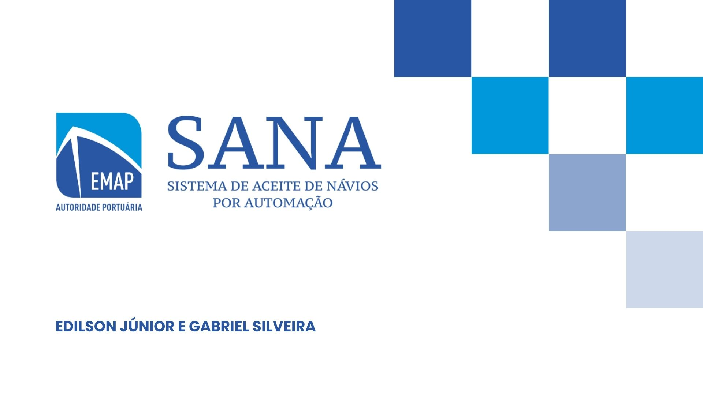

# Projeto SANA - Sistema de Aceite de Navios Automatizado

Projeto relativo ao II HACKATHON - IFMA de desenvolvimento de soluções inovadoras utilizando Inteligência Artificial.

## Descrição:
O referido projeto faz jus a solução da problemática de Aceite de Navios no Porto do Itaqui, administrado pela EMAP.
Como resolução, está em desenvolvimento o sistema SANA, que visa fazer a automação do processo de aceite de navios no Porto do Itaqui, utilizando algoritmos de Inteligência Artificial.

## Tecnologias utilizadas:
- Linguagem Python:
1. Bibliotecas voltadas para Análise de Dados e Machine Learning (Pandas, NumPy, Scikit-Learning, LIME)
2. Jupyter Notebook
3. Flask

